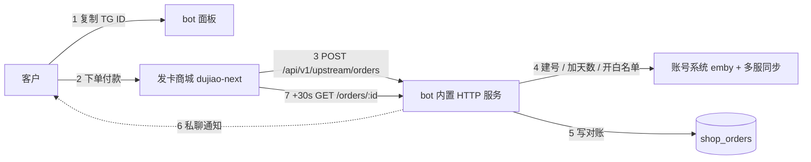

# Emby 账号系统 × 发卡站 对接设计（冻结版）

- 状态：**已实施并通过验收（2026-09-19）**
- 日期：2026-09-19
- 适用版本：本仓库当前 `master`（`5e987c5` 之后）
- 对接对象：`dujiao-next`（Go 发卡商城，本地路径 `/opt/dujiao-next`）
- 配套文档：[对商城侧的要求](./shop-integration-requirements.md)

> 实施记录见本文末 [§15 实施与验收记录](#15-实施与验收记录)。

---

## 1. 目标与范围

### 1.1 目标
1. 客户在发卡站购买**天数卡**（30/90/180 天）或**白名单卡**，付款后由 bot **自动**完成开通：无账号则建号，有账号则加天数 / 开白名单。
2. 账号、密码、线路等信息**只通过 Telegram 私聊**发给客户，商城页面只显示"购买成功"。
3. 用发卡站取代 bot 内的自由注册与注册码，成为**唯一的新用户入口**。
4. 全流程保留对账记录，失败可人工追溯与重放。

### 1.2 非目标（明确不做）
- 不做退款、纠纷、售后流程（商城侧自行处理，客户收不到会自动联系管理员）。
- 不接非 TG 的 `emby2` 老账号（553 个），后续独立出去。
- 不做分区（媒体库分级授权）体系，删掉分区通行码整套。
- 不改造商城代码；商城侧改动只以《对商城侧的要求》形式提出。
- 不做异步任务队列、不做上游回调推送、不做商城侧失败处理。

---

## 2. 名词

| 名词 | 含义 |
|---|---|
| 商城 | dujiao-next 发卡站，本方案中的"下游 A 站" |
| 我们 / 上游 | 本仓库 bot，本方案中的"上游 B 站" |
| TG ID | 客户在 Telegram 的数字用户 ID，本方案唯一的身份标识 |
| 天数卡 | 增加到期日的商品，档位 30 / 90 / 180 天 |
| 白名单卡 | 一次性开通永久白名单（`lv='a'`）的商品 |

---

## 3. 总体架构



- 我们充当商城的**上游供货方**：商品由我们提供，商城负责展示与收款。
- 通信为**商城 → 我们**的单向调用（我们不需要回调商城）。
- 我们与商城同机部署时，商城可访问 `http://127.0.0.1:<port>`；商城的私网限制只作用于"它回调下游"，不影响它调用上游。

---

## 4. 业务流程

### 4.1 正常流程（4 步）
1. 客户在 bot 面板复制自己的 **TG ID**（面板同时显示"去商城"入口）。
2. 客户到商城选择商品、填写 **TG ID**、付款。
3. 商城调用我们 `POST /api/v1/upstream/orders`（同步调用，超时 30 秒）。
4. 我们**当场完成**全部动作并返回成功：
   - 校验 TG ID 是否在库；
   - 建号（无账号）或加天数 / 开白名单；
   - 写对账记录；
   - 返回中性交付文案；
   - 之后**异步**私聊客户发送账号 / 密码 / 线路 / 到期时间（白名单卡额外私聊通知 owner 备案）。

商城随后（约 30 秒）调用一次 `GET /api/v1/upstream/orders/:id` 取终态，我们返回已存结果，订单在商城侧完成。

### 4.2 失败处理（刻意简化）
| 场景 | 我们内部行为 | 对商城返回 | 客户感知 |
|---|---|---|---|
| TG ID 不在库（填错 / 未与 bot 对话） | 记录失败原因，私聊 owner 告警 | 仍返回 `ok: true` + 中性文案 | 收不到消息，自行联系管理员 |
| Emby 接口报错 / 数据库写失败 | 记录失败原因 + 可重放标记，私聊 owner | 同上 | 同上 |
| 重复请求（同订单号） | 直接返回已存结果 | `ok: true` | 不重复加天数 |

**约定：我们对商城永远返回成功**，商城侧不出现失败订单，也不需要失败提示或退款联动；所有异常只在我们这边留痕与告警。

---

## 5. 商品与表单

### 5.1 商品清单

| 商品 | 我们上报的 `id` | SKU | 天数 | 交付结果 |
|---|---|---|---|---|
| 会员天数卡 | 1 | 1 / 2 / 3 | 30 / 90 / 180 | 到期日 = 原到期日 + 天数（已过期则从现在起算并解封） |
| 白名单卡 | 2 | 4 | 永久 | `lv='a'`，到期日保持不变 |

- 价格：我们统一返回 `price_amount = "0.00"`，**售价由商城后台自定**（商城须关闭"自动同步价格"）。
- 库存：始终 `stock_status = "unlimited"`、`stock_quantity = -1`。
- `fulfillment_type`：统一上报 `manual`（商城据此向买家采集下方表单）。
- `currency`：`CNY`。

### 5.2 买家填写表单（由我们下发，商城原样使用）

```json
{
  "fields": [
    {
      "key": "tg_id",
      "type": "text",
      "label": { "zh-CN": "Telegram ID", "zh-TW": "Telegram ID", "en-US": "Telegram ID" },
      "placeholder": {
        "zh-CN": "请从 Telegram 机器人复制你的数字 ID",
        "zh-TW": "請從 Telegram 機器人複製你的數字 ID",
        "en-US": "Copy your numeric ID from the Telegram bot"
      },
      "required": true,
      "regex": "/^[0-9]{5,15}$/",
      "max_len": 15
    }
  ]
}
```

- 只采集 TG ID，**不多采集任何字段**（不需要用户名、邮箱、备注）。
- 正则只保证"纯数字"，**不保证该 TG 存在**——存在性校验由我们在下单后执行（商城不支持下单前远程校验，见 7.4）。

---

## 6. 接口设计

### 6.1 基础约定

| 项 | 约定 |
|---|---|
| 协议名 | 商城侧"站点连接"的 `protocol` 必须为 `dujiao-next` |
| Base URL | 我们 bot 内置 HTTP 服务地址（如 `http://127.0.0.1:8838`，端口可配） |
| 鉴权头 | `Dujiao-Next-Api-Key` / `Dujiao-Next-Timestamp` / `Dujiao-Next-Signature` |
| 签名 | `HMAC-SHA256(secret, "{method}\n{path}\n{timestamp}\n{md5(body)}")`，hex 小写；时间戳窗口 ±60 秒；`GET` 的 body 为空串 |
| 编码 | 请求与响应均 `application/json; charset=utf-8` |
| 幂等键 | 商城的 `downstream_order_no`（商城订单号） |

签名参考实现（与商城 `internal/upstream/signer.go` 逐字对齐）：
```
body_md5  = md5_hex(raw_body)           # 空 body 时为 md5("")
sign_str  = f"{METHOD}\n{path}\n{timestamp}\n{body_md5}"
signature = hex(hmac_sha256(api_secret, sign_str))
```

### 6.2 端点总览

| # | 方法 | 路径 | 用途 | 必要性 |
|---|---|---|---|---|
| 1 | POST | `/api/v1/upstream/ping` | 连通性探测 | 商城"测试连接"用 |
| 2 | GET | `/api/v1/upstream/categories` | 分类列表 | 商城导入商品用 |
| 3 | GET | `/api/v1/upstream/products` | 商品列表 | 商城导入/定期同步用 |
| 4 | GET | `/api/v1/upstream/products/:id` | 商品详情 | 商城同步单品用 |
| 5 | POST | `/api/v1/upstream/orders` | **下单 + 同步开通** | 核心 |
| 6 | GET | `/api/v1/upstream/orders/:id` | 查单（只读已存结果） | 商城固定会调一次 |
| 7 | POST | `/api/v1/upstream/orders/:id/cancel` | 取消 | 返回成功但**不撤销**服务 |

### 6.3 ping

请求：空 body。

响应：
```json
{
  "ok": true,
  "site_name": "Sakura Emby",
  "protocol_version": "1.0",
  "user_id": 1,
  "balance": "0.00",
  "currency": "CNY",
  "member_level": {}
}
```
说明：`balance` 固定 0（我们不做钱包结算，商城侧也不会因此扣款失败）。

### 6.4 categories / products

`GET /categories`：
```json
{ "ok": true, "categories": [ { "id": 1, "name": { "zh-CN": "会员服务", "en-US": "Membership" }, "slug": "membership", "sort_order": 1 } ] }
```

`GET /products?page=1&page_size=20`：
```json
{
  "ok": true,
  "total": 2,
  "items": [
    {
      "id": 1,
      "title": { "zh-CN": "会员天数卡", "en-US": "Membership Days Card" },
      "description": { "zh-CN": "延长账号有效期", "en-US": "Extend your account" },
      "content": { "zh-CN": "购买后由 Telegram 机器人自动开通并发送账号信息。", "en-US": "..." },
      "images": [],
      "tags": ["会员"],
      "price_amount": "0.00",
      "currency": "CNY",
      "fulfillment_type": "manual",
      "manual_form_schema": { "fields": [ /* 见 5.2 */ ] },
      "is_active": true,
      "category_id": 1,
      "skus": [
        { "id": 1, "sku_code": "DAYS-30",  "spec_values": { "zh-CN": "30 天" },  "price_amount": "0.00", "stock_status": "unlimited", "stock_quantity": -1, "is_active": true },
        { "id": 2, "sku_code": "DAYS-90",  "spec_values": { "zh-CN": "90 天" },  "price_amount": "0.00", "stock_status": "unlimited", "stock_quantity": -1, "is_active": true },
        { "id": 3, "sku_code": "DAYS-180", "spec_values": { "zh-CN": "180 天" }, "price_amount": "0.00", "stock_status": "unlimited", "stock_quantity": -1, "is_active": true }
      ],
      "updated_at": "2026-09-19T12:00:00+08:00"
    },
    {
      "id": 2,
      "title": { "zh-CN": "永久白名单卡", "en-US": "Permanent Whitelist" },
      "price_amount": "0.00",
      "currency": "CNY",
      "fulfillment_type": "manual",
      "manual_form_schema": { "fields": [ /* 同上 */ ] },
      "is_active": true,
      "category_id": 1,
      "skus": [
        { "id": 4, "sku_code": "WL-PERM", "spec_values": { "zh-CN": "永久" }, "price_amount": "0.00", "stock_status": "unlimited", "stock_quantity": -1, "is_active": true }
      ],
      "updated_at": "2026-09-19T12:00:00+08:00"
    }
  ],
  "includes_inactive": true
}
```

`GET /products/:id` 返回单个商品对象（结构同上，无 `total/items` 包装）。

### 6.5 下单（核心）

请求体：
```json
{
  "sku_id": 1,
  "quantity": 1,
  "manual_form_data": { "tg_id": "123456789" },
  "downstream_order_no": "202609191234567890",
  "trace_id": "a1b2c3",
  "callback_url": ""
}
```

处理步骤（同一请求内同步完成）：
1. 幂等检查：`downstream_order_no` 已存在 → 直接返回该订单已有结果，不重复执行。
2. 解析 `manual_form_data.tg_id`，校验为纯数字。
3. 查库：TG 不存在 → 记失败（`no_such_tg`），仍返回成功。
4. 按 SKU 执行：
   - SKU 1/2/3（天数卡）：`days = 30/90/180 × quantity`
     - 无账号 → 建号（见 8.2），`ex = now + days`；
     - 有账号且未过期 → `ex = ex + days`；
     - 有账号且已过期 → `ex = now + days`，`lv: c→b`，并恢复 Emby 播放策略。
   - SKU 4（白名单卡）：要求已有账号；`lv='a'`，不动 `ex`。
5. 多服同步（见 8.3），写对账记录。
6. 异步私聊客户；白名单卡额外私聊 owner。
7. 返回：

```json
{
  "ok": true,
  "order_id": 1001,
  "order_no": "SK20260919000001",
  "status": "delivered",
  "amount": "0.00",
  "currency": "CNY"
}
```

字段说明：
- `order_id`：我们这边的订单主键（商城后续查单用它）。
- `order_no`：我们这边的订单号（对账展示用）。
- `status`：恒为 `delivered`（商城侧按"已交付"处理）。
- `amount`：`0.00`（不参与结算）。

### 6.6 查单

`GET /api/v1/upstream/orders/:id`：
```json
{
  "order_id": 1001,
  "order_no": "SK20260919000001",
  "status": "delivered",
  "amount": "0.00",
  "currency": "CNY",
  "fulfillment": {
    "type": "manual",
    "status": "delivered",
    "payload": "账号信息已通过 Telegram 发送",
    "delivery_data": { "note": "账号信息已通过 Telegram 发送" },
    "delivered_at": "2026-09-19T12:34:56+08:00"
  }
}
```

- 该端点是**只读**的：直接返回下单时已写入的结果，不做任何处理，也不引入异步等待。
- `payload` / `delivery_data` 为**中性文案**，绝不含账号、密码、线路等敏感信息（商城订单页会展示它）。
- 商城会在下单成功约 30 秒后调用一次（其采购流程固定行为，见商城 `procurement/application/submit.go:128`、`poll.go:24-72`）。

### 6.7 取消

`POST /api/v1/upstream/orders/:id/cancel`：返回 `{ "ok": true }`。

- 已开通的服务**不会**被撤销（我们的业务不接受退款回滚）。
- 对账表记录一条"商城请求取消，未撤销"备注，供管理员查阅。

### 6.8 我们永不返回的失败

商城侧不会看到 `ok: false`。以下内部状态只写在我们的对账表里：

| 内部状态 | 含义 |
|---|---|
| `ok` | 已成功开通 |
| `no_such_tg` | 表单里的 TG ID 不在我们库中 |
| `no_account_for_whitelist` | 白名单卡但该 TG 没有账号 |
| `emby_error` | 建号 / 改策略 / 多服同步失败 |
| `db_error` | 写库失败 |

---

## 7. 为什么这样设计（关键事实与取舍）

1. **身份只传 TG ID**：商城用户体系与我们无关，TG ID 是唯一可靠锚点。
2. **下单后校验而非下单前**：商城不支持"表单远程校验"，也不支持链接预填表单（商城表单校验只在其服务器本地按静态 schema 执行，见 `catalog/product/manualform/schema.go`、`order/application/order_service_validate.go:214`；上游协议没有校验端点，见 `upstreamapi/transport/http/routes.go:9-15`）。因此 TG 存在性只能在收到订单后校验，失败即人工处理。
3. **商城一定会查单一次**：其采购流程把上游订单置为 `accepted` 后固定轮询 `GetOrder`（首次 30 秒）。我们不做异步，只把结果存好供读取。
4. **商城侧不出现失败**：简化运营；异常只留痕 + 告警 owner，客户收不到消息会自行联系。
5. **交付内容不含敏感信息**：商城订单页会显示交付内容，账号密码一律走 Telegram。

---

## 8. 账号侧规则

### 8.1 校验
- `tg_id` 必须为纯数字且在 `emby` 表中存在（即与 bot 对话过）。
- 不存在 → 内部失败 `no_such_tg`。

### 8.2 自动建号
| 项 | 规则 |
|---|---|
| 用户名 | **6 位**：3 位小写字母 + 3 位数字（如 `kfd482`），随机生成；与现有账号重名则重试（最多 10 次） |
| 密码 | 沿用现有 `pwd_create(8)`（8 位随机） |
| 多服 | 使用现有 `emby_create_all(name, days, lv)`：主服失败即整体失败；其余服务器同号同密，失败只标记"未开通" |
| 等级 | `lv='b'`、`cr=now`、`ex=now+days` |
| 媒体库 | **全部可见**（不再隐藏任何库） |

### 8.3 天数与白名单
- 天数卡：按下单数量累加（买 2 张 30 天 = 60 天）；已过期则从当下起算并解封（`lv: c→b` + 恢复播放策略）。
- 白名单卡：要求已有账号；`lv='a'`，`ex` 保持原值（交付文案写"永久"），成功后私聊 owner 备案。
- 所有改动同步到该 TG 已开通的全部 Emby 服务器；某台失败时保留记录，由对账表标注，管理员可重放。

### 8.4 幂等
- 以 `downstream_order_no` 唯一约束；重复请求直接返回首次结果。
- 同一请求重复到达（商城重试）不会重复加天数。

---

## 9. bot 侧改动

| 区域 | 改动 |
|---|---|
| 用户面板 | 显示 **TG ID（可复制）** + **去商城**按钮；无账号用户面板引导去商城（不再有"创建账户"按钮） |
| 后台面板 | 新增：商城地址、上游 API Key / Secret（可查看/重置） |
| 通知 | 开通成功私聊客户：账号 / 密码 / 到期时间 / 线路；白名单卡：私聊 owner |
| 新增命令 | 管理员查对账：列表 + 详情 + 按订单号重放（`/shop_orders` 等） |
| 删除 | 自由注册（含定时注册）、注册码、赠送码、分区通行码整套、媒体库显示/隐藏、账号人数上限、"创建账户"自助入口 |
| 保留 | 续期码（= 天数）、白名单码、`/renew`、`/prouser`、`/revuser`、`/ucr`、封禁与删号 |

---

## 10. 数据模型变更

### 10.1 新增：`shop_orders`（对账表）

| 列 | 类型 | 说明 |
|---|---|---|
| `id` | INT PK AI | 我们这边的订单主键（返回给商城的 `order_id`） |
| `order_no` | VARCHAR(32) UNIQUE | 我们这边的订单号（如 `SK20260919000001`） |
| `downstream_order_no` | VARCHAR(64) **UNIQUE** | 商城订单号（幂等键） |
| `trace_id` | VARCHAR(64) NULL | 商城透传 |
| `sku_code` | VARCHAR(32) | `DAYS-30` / `DAYS-90` / `DAYS-180` / `WL-PERM` |
| `quantity` | INT | 数量 |
| `days` | INT | 实际增加的天数（白名单卡为 0） |
| `tg` | BIGINT | 客户 TG ID |
| `embyid` | VARCHAR(255) NULL | 操作后的 Emby 账户 ID |
| `emby_name` | VARCHAR(255) NULL | 账户名（新用户为随机名） |
| `ex_before` / `ex_after` | DATETIME NULL | 到期日前后 |
| `lv_before` / `lv_after` | VARCHAR(1) NULL | 等级前后 |
| `status` | VARCHAR(24) | `ok` / `no_such_tg` / `no_account_for_whitelist` / `emby_error` / `db_error` |
| `error_message` | VARCHAR(255) NULL | 失败原因 |
| `created_account` | TINYINT | 是否本次新建账号 |
| `notify_state` | VARCHAR(16) | `sent` / `failed` / `skipped` |
| `replayed_from` | INT NULL | 重放来源订单 ID |
| `created_at` / `updated_at` | DATETIME | |

### 10.2 删除
- `emby.us`（天数池列）、`emby2.pwd2` 之外的遗留：删除 `us` 及其"≥30 自动续期"逻辑。
- `partition_codes`、`partition_grants` 两张表及全部相关代码。
- 配置项：`open.stat`、`open.timing`、`open.open_us`、`open.all_user`（上限）、`open.tem` 计数逻辑、`partition_libs`、`emby_block`、`extra_emby_libs`。

### 10.3 保留但不再使用
- `Rcode` 表（续期码 / 白名单码继续使用；历史注册码数据保留但不再被识别）。
- `emby2` 相关表与逻辑（暂不处理）。

---

## 11. 配置项

新增（后台面板可改，落 `config.json`）：
```jsonc
"shop": {
  "enabled": true,                  // 是否启用商城对接
  "listen_host": "127.0.0.1",       // HTTP 监听地址
  "listen_port": 8838,              // HTTP 监听端口
  "api_key": "由系统生成",            // 提供给商城
  "api_secret": "由系统生成",         // 提供给商城
  "site_name": "Sakura Emby",       // ping 返回的站点名
  "url": "https://shop.example.com" // 面板"去商城"按钮跳转地址
}
```

删除：`open.stat`、`open.timing`、`open.open_us`、`open.all_user`、`partition_libs`、`emby_block`、`extra_emby_libs`、`schedall.partition_check`。

---

## 12. 迁移与上线步骤

1. 新增迁移脚本：建 `shop_orders` 表；删 `emby.us` 列；删 `partition_codes` / `partition_grants` 表。
2. 配置迁移：写入 `shop` 段（key/secret 自动生成），移除已废弃字段。
3. 存量数据处理：
   - 对全部有账号用户执行一次**全库放开**（原"隐藏媒体库"的用户恢复全可见）；
   - 历史未使用注册码：保留数据，系统不再识别（兑换报"无效"）。
4. 部署顺序：先部署我们（提供上游接口）→ 商城侧配置"站点连接"并测试连接 → 导入商品并定价 → 小金额真实下单验证 → 全量开放。
5. 回滚：`shop.enabled=false` 即关闭对接（商城侧订单会失败，需人工处理）；数据库迁移为单向，回滚需手工补列/补表。

---

## 13. 验收清单

- [x] 商城"测试连接"通过（ping 返回 `ok: true`）。
- [x] 商城能导入 2 个商品 / 4 个 SKU，表单字段为 TG ID 且必填。
- [x] 天数卡（新用户）：下单后 30 秒内商城订单完成；客户收到 bot 私聊（账号/密码/到期时间/线路）；数据库中 `emby` 记录 `lv='b'`、`ex = now + 天数`。
- [x] 天数卡（老用户未过期）：`ex` = 原到期日 + 天数；已过期用户：从现在起算并解封（Emby 策略恢复）。
- [x] 多服：`emby_server_accounts` 中所有已开通服务器均有该账号，密码一致。
- [x] 白名单卡（有账号）：`lv='a'` 且 `ex` 未变；owner 收到备案私聊。
- [x] 白名单卡（无账号）：内部状态 `no_account_for_whitelist`，商城订单仍显示成功，owner 收到告警。
- [x] 故意填错 TG ID：内部状态 `no_such_tg`，商城订单成功，客户无消息，对账表可查。
- [x] 幂等：用同一 `downstream_order_no` 重复调用，天数只增加一次。
- [x] 查单：`GET /orders/:id` 返回 `delivered` 且 `payload` 不含敏感信息。
- [x] 对账：管理员命令能按 TG / 订单号查询并重放失败单。
- [x] 删除项验证：bot 内已无自由注册、注册码、赠送码、分区码、媒体库隐藏、人数上限入口。

---

## 14. 风险与已知取舍

| 风险 | 说明 | 处理 |
|---|---|---|
| 买家填错 TG ID | 天数会加到别人账号上 | 商城表单正则 + 我们校验存在性；被误加者会收到 bot 消息，可联系管理员；对账可查 |
| 商城请求超时（30 秒） | 多服建号可能超时 | 返回前只做必要写库；通知走异步；超时重试由幂等兜底 |
| 密码出现在商城订单页 | 已通过"交付内容不含敏感信息"规避 | 商城订单页只显示中性文案 |
| 退款无法回滚服务 | 商城退款后服务仍在 | 业务上接受（白名单卡标注不可退） |
| 存量非 TG 账号 | 553 个 `emby2` 不在新流程内 | 后续独立项目处理 |

---

## 15. 实施与验收记录

### 15.1 落地文件

| 位置 | 内容 |
|---|---|
| `bot/web/api/shop.py` | 七个上游端点 + HMAC-SHA256 鉴权（`method\npath\ntimestamp\nmd5(body)`，query 不参与签名） |
| `bot/func_helper/shop.py` | 同步开通：落库 → 建号/续期/白名单 → 私聊交付；`operation_stage` 断点续跑；`downstream_order_no` 幂等 |
| `bot/sql_helper/sql_shop.py` | `shop_orders` 对账表读写 |
| `bot/sql_helper/alembic/versions/20260919_05_shop_orders.py` | 建 `shop_orders`；删 `emby.us`；删 `partition_codes` / `partition_grants` |
| `bot/modules/commands/shop_orders.py` | `/shop_orders`、`/shop_order`、`/shop_replay` 管理员对账 |
| `bot/modules/panel/config_panel.py`、`bot/func_helper/fix_bottons.py` | 商城配置面板（地址 / Key / Secret 查看与重置）、封存天数、用户面板 TG ID 与"去商城"入口 |
| `scripts/migrate_shop_libraries.py` | 存量账号全库放开（一次性、幂等、可重跑） |
| 删除 | 自由注册与定时注册、注册码/赠送码、分区通行码整套、媒体库显隐、人数上限、`emby.us` 天数池 |

保留：`/ucr` 非 TG 建号、`/uinfo`、`/urm`、`/userip`、`/udeviceid`、续期码 / 白名单码、`/renew`、`/prouser`、`/revuser`、封禁与删号。

### 15.2 验收执行

- 存量迁移：`python3 scripts/migrate_shop_libraries.py` → `attempted=1460 failed=0`（Emby 侧受限媒体库用户数 0）。
- 接口验收：真实 HMAC 签名打 7 个端点（含错误 key / 错误 secret / 过期时间戳 / 篡改 body / 错签 query 的拒绝路径），并逐字段核对商城 Go 适配器结构体（`internal/upstream/{adapter.go,dujiao_next.go}`）。
- 业务验收：新用户建号、老用户累加天数、过期用户解封（Emby 策略 `IsDisabled` c→b）、2×30=60 天累加、白名单 `lv='a'` 且 `ex` 不变、无账号白名单 `no_account_for_whitelist`、错误 TG `no_such_tg`、幂等重复投递、查单隐私、取消不回滚、失败单重放。
- 交付验收：通知文案含账号 / 密码 / 到期时间 / 线路；白名单备案私聊 owner（测试以替身 bot 校验文案与状态落库）。
- 结果：**91/91 项通过**；`python3 -m unittest scripts.test_multi_server` 12 项通过；验收后数据库与 Emby 测试残留为 0。

### 15.3 环境限制

- 本机无 Go 工具链，商城侧运行态验收（商城后台"测试连接"→ 导入商品 → 真实下单）需在商城环境执行；本次以商城自身适配器源码逐字段核对协议替代。
- 本机无法访问 Telegram，`notify_state` 在离线环境下记为 `failed`（文案与落库逻辑已用替身 bot 验证）；上线后首次实单需确认客户实际收到私聊。
